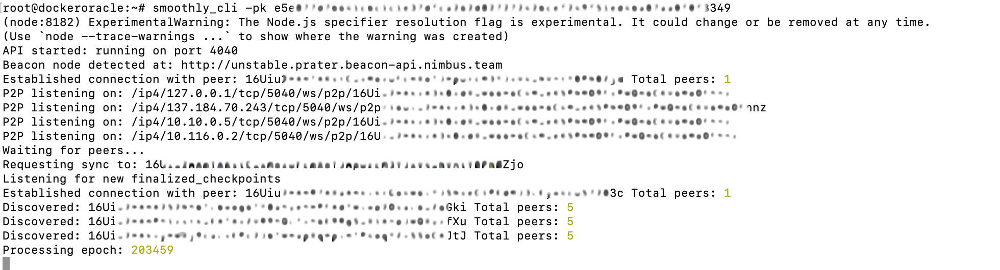

<p align="center"><a href="https://docs.smoothly.money/"></a></p>

# Smoothly Pool Operator Node

[](https://github.com/Smoothly-Protocol/oracle/releases)


## Prerequisites

- :gear: [NodeJS](https://nodejs.org/) (LTS)
- :toolbox: [Yarn](https://yarnpkg.com/)/[npm](https://npmjs.com/)

# Build Smoothly Oracle from source
```sh
sudo apt update
```

This command updates the list of available packages from the repositories.

---
### Step 1: Install Libraries
```sh
sudo apt install build-essential libssl-dev curl
```

This command installs essential build tools and libraries required for building software from source.

---
### Step 2: Install (NVM) and Nodejs and git
```sh
curl -o- https://raw.githubusercontent.com/nvm-sh/nvm/v0.39.1/install.sh | bash

source ~/.bashrc
```

These commands install the Node Version Manager (NVM), which allows you to install and manage multiple versions of Node.js.

---

```sh
nvm install v18.16.0
```

This command installs a specific version of Node.js using NVM.

---

```sh
sudo apt install git
```

This command installs Git, a version control system used for tracking changes in source code during software development.

---
### Step 3: Clone the repository
```sh
git clone https://github.com/Smoothly-Protocol/oracle.git

cd oracle
```

This command clones the specified repository to your local machine, then moves to that directory.

---
### Step 4: Build and start Smoothly

```sh
git pull
```
Makes sure your repo is up to date

---
```sh
npm install

npm install typescript

npm run build

npm link
```
These commands use npm to build  the Smoothly client

---
```sh
smoothly_cli -pk <your private key> -n goerli 
```
---
Start Smoothly, the expected response is below  

<p align="center"></a></p>

---
## Additional Flags

At this point, you're running the operator node! Please use the following flags to identify your EL and CL connections, and if you're behind a router, you'll need to announce your IP to be reachable for syncing. 

-b identifies which beacon node api to connect to (ex. for prysm -b http://localhost:3500) If you'd like to identify a fall back node, you may do so, comma separated and in "quotes":  

```-b "http://localhost:3500,http://127.0.0.1:3500"```

-eth1 identifies which eth1 api to connect to (ex. for geth -eth1 http://localhost:8545) If you'd like to identfity an eth1 fallback node, you may do so, comma separated and in "quotes":

```-eth1 "http://localhost:8545,http://127.0.0.1:8545"```

If you're running at home, you're probably behind a router. Although you will be able to reach your peers, they will not be able to sync from you in the event they fall out of consensus. Please verify that upnp is enabled on your router, and allow p2p connections with your oracle peers on port 5040. 

```sudo ufw allow 5040```

Then add these additional flags to become reachable. 

```-nat -ip <your_public_ip>```

## Create a Systemd Service File
```
sudo nano /etc/systemd/system/smoothly.service
```
Open a editable system file
```
[Unit]
Description=Smoothly CLI
After=network.target

[Service]
User=<YOUR USERNAME>
Group=<YOUR GROUPNAME>
WorkingDirectory=/home/<YOUR USERNAME>/oracle
ExecStart=/home/<YOUR USERNAME>/.nvm/versions/node/v18.16.0/bin/smoothly_cli -pk YOUR_PRIVATE_KEY -n goerli
Restart=always
Environment=PATH=/home/<YOUR USERNAME>/.nvm/versions/node/v18.16.0/bin:/usr/bin:/usr/local/bin

[Install]
WantedBy=multi-user.target
```
Copy and paste the above into the system file, replace YOUR USERNAME and YOUR_PRIVATE_KEY
```
sudo systemctl daemon-reload
```
Reload service
```
sudo systemctl enable smoothly
```
Enable smoothly to autoboot on restart
```
sudo systemctl start smoothly
```
start service
```
sudo journalctl -fu smoothly
```
check logs to verify connections

## Update the smoothly cli
```
sudo systemctl stop smoothly
```
Stop the service
```
cd oracle
```
Move into the oracle directory
```
git pull
```
Pull new changes 
```
npm run build
```
Build with new changes
```
npm link
```
Link 
```
sudo systemctl start smoothly
```
Start smoothly service

## Smoothly Oracle Docker Installation Guide
### Step 1: Update Your System  
Update your system package list to ensure you have the latest repository information:
```
sudo apt update
```
### Step 2: Install Docker and Docker Compose  
Download the Docker installation script and execute it to install Docker:
```
curl -fsSL https://get.docker.com -o get-docker.sh
sudo sh get-docker.sh
```
Next, install Docker Compose by downloading the latest version and making it executable:
```
sudo curl -L "https://github.com/docker/compose/releases/download/1.29.2/docker-compose-$(uname -s)-$(uname -m)" -o /usr/local/bin/docker-compose
sudo chmod +x /usr/local/bin/docker-compose
```
To verify the installation of Docker and Docker Compose, use the following commands:
```
docker --version
docker-compose --version
```

### Step 3: Pull the Docker Image  
Pull the latest version of your Docker image from GitHub:
```
docker pull ghcr.io/smoothly-protocol/oracle:latest
```
### Step 4: Run the Docker Container in Detached Mode  
Run the Docker container in detached mode with the name "smoothlyoracle". Replace <`your private key`>, <`your beacon client`>, and <`your EL client`> with the appropriate values for your setup:
```
docker run -d --name=smoothlyoracle ghcr.io/smoothly-protocol/oracle:latest smoothly_cli -pk <your private key> -n goerli -b <your beacon client> -eth1 <your EL client>
```

### Step 5: View Logs  
To view the logs of the running container, use the docker logs command followed by the container name:
```
docker logs -f smoothlyoracle
```
## Usage 
`smoothly_cli -pk <YOUR_PRIVATE_KEY> -n <goerli defaults> -b <beacon api> -eth1 <your EL client> `

## Tests 

In order to run tests, the following configuration is needed:  
1. Local network: `anvil`, install if necessary.
2. `yarn test`
